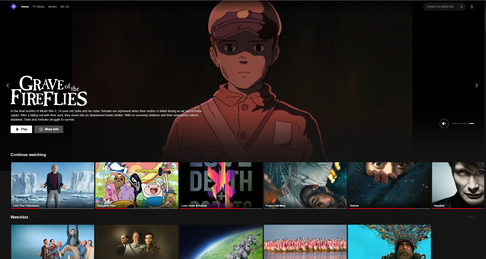
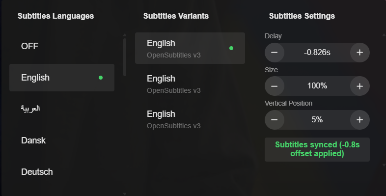
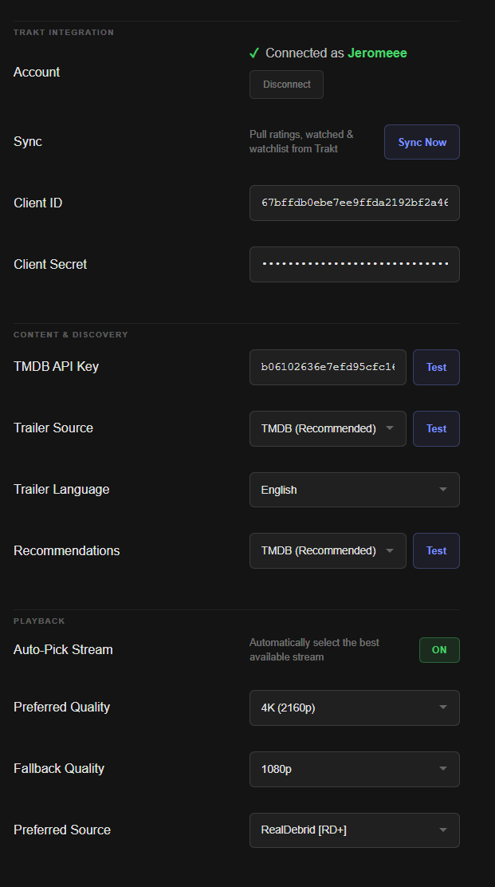

# Stremio Custom UI — Netflix Redesign + Whisper Auto-Sync

A custom Stremio Web UI with a Netflix-style redesign and AI-powered automatic subtitle synchronization.



## Features

- **Netflix-style UI** — clean, modern interface with hero banners, continue watching, and watchlist rows
- **Whisper Auto-Sync** — automatically syncs external subtitles using OpenAI's Whisper model running locally in your browser (WASM/WebGPU)
- **Trakt Integration** — watchlist, ratings, scrobbling, and personalized recommendations
- **GPU Acceleration** — uses WebGPU when available for fast transcription, falls back to WASM
- **Zero Setup** — download one file, double-click, done



## Setup Guide

### 1. Install Stremio

Download and install Stremio from the official website: [stremio.com/downloads](https://www.stremio.com/downloads)

### 2. Create a Stremio Account

Open Stremio and create an account, or log in if you already have one.

### 3. Install the Torrentio Addon

1. Go to the **Addons** section in Stremio
2. Search for **Torrentio** and install it
3. If you use a debrid service (Real-Debrid, AllDebrid, etc.), configure it in the Torrentio addon settings

### 4. Download the Launcher

Go to the [latest release](https://github.com/jeromenicholas07/stremio-web-netflix/releases/latest) and download the launcher for your OS:

| OS | File | How to run |
|---|---|---|
| Windows | `launch-stremio.bat` | Double-click |
| macOS | `launch-stremio.command` | Right-click → Open (first time), then double-click |

### 5. Launch

Double-click the launcher. Stremio opens with the custom UI. No terminal windows, no extra software.

### 6. Connect Trakt (Optional)

For personalized recommendations and watch history tracking:

1. Open **Settings** in the custom UI
2. Under **Trakt Integration**, click **Login with Trakt**
3. Authorize the app in your browser
4. Click **Sync Now** to pull your watchlist and ratings



## How Auto-Sync Works

When you select external subtitles, Whisper automatically:

1. Extracts a sample of audio from the video
2. Transcribes it locally using AI (nothing sent to the cloud)
3. Aligns the transcription against subtitle text
4. Applies the correct delay offset

The Whisper model (~75MB) downloads once on first use and caches locally. Subsequent uses are instant.

## For Developers

### Prerequisites

- Node.js 18+
- [pnpm](https://pnpm.io/installation) 10+

### Development

```bash
pnpm install
pnpm start
```

### Production Build

```bash
PUBLIC_PATH="/stremio-web-netflix/" pnpm run build
```

## License

Based on [Stremio Web](https://github.com/Stremio/stremio-web), copyright 2017-2023 Smart code, available under GPLv2. See [LICENSE](/LICENSE.md).
